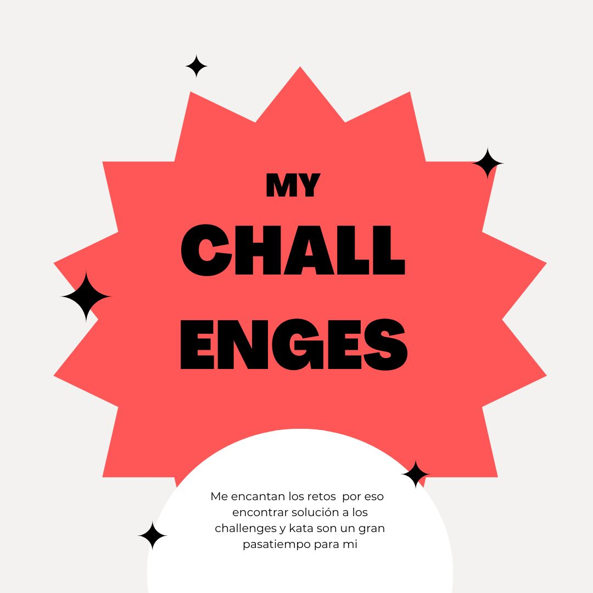

# my-challenges

## Welcome! 👋

En este repositorio estarán recopilados los challenges y katas que voy haciendo para poner en practica mis skills en frontend.

## Indice
- [Proyectos](#proyectos)
  - [Words Counter](#words-counter)
  - [Tip calculator app](#tip-calculator-app) 
  - [Random-color generator](#random-color-generator) 
  - [404 not found](#404-not-found)
  - [My gallery](#my-gallery)
- [Recursos](#recursos)
- [Contacto](#contacto)

## Proyectos
### Tip calculator app 
Mi solución para el challenge de [Frontend Mentor](https://www.frontendmentor.io/).
Crea una aplicación para calcular el importe de la propina y el coste de la cuenta por persona.
Practica DOM.

[Demo](lupemorales.github.io/tip-calculator-app/) |
[Code](https://github.com/lupeMorales/tip-calculator-app)

### Words-counter
Crea una pequeña aplicación para contar en tiempo real las palabras que vas escribiendo.
Práctica DOM.

[Demo](https://lupemorales.github.io/word-counter/) |
[Code](https://github.com/lupeMorales/word-counter)

### Random-color  generator
Pulsa el botón y genera de forma automática y aleatoria un color.
Práctica DOM.Math()

[Demo](https://github.com/lupeMorales/random-color-generator) |
[Code](https://github.com/lupeMorales/random-color-generator)

### 404 not found
Mi solución para el challenge de [DevChallenges](https://devchallenges.io/).
Pon en practicas tus skills en CSS maquetando esta página 404.

[Demo](https://lupemorales.github.io/404-not-found/) |
[Code](https://github.com/lupeMorales/404-not-found)

### My gallery
Mi solución para el challenge de [DevChallenges](https://devchallenges.io/).
Crea una página estática poniendo en practicas tus habilidades con grid layout.

[Demo](https://lupemorales.github.io/my-gallery/)
[Code](https://github.com/lupeMorales/my-gallery)

## Recursos

- [Frontend Mentor](https://www.frontendmentor.io/). Frontend Mentor me ayuda a mejor como desarrolladora practicando con proyectos reales.
- [DevChallenges](https://devchallenges.io/) - Esta web es sensacional. Ofrece distintas rutas de aprendizaje (responsive desig, frontend, full stack) para practicar nuestras habilidades como desarrollador.
- [Grid Layout](https://css-tricks.com/snippets/css/complete-guide-grid/)

## Contacto

- Website - [My portfolio web](https://lupemorales.github.io/portfolio/)
- Linkedin - [@LupeMorales](https://www.linkedin.com/in/lupe-morales/)

**Have fun coding!** 🚀
